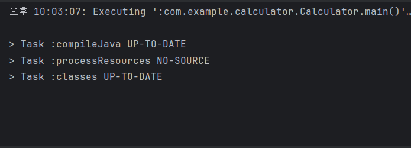
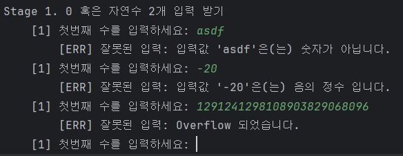
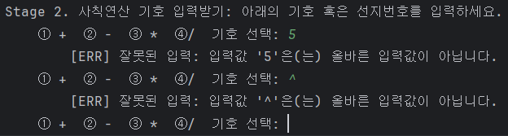
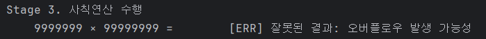
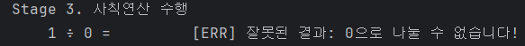

# [Spring 5기] CH 2 계산기 과제

---

## 개발환경

- IDE : IntelliJ IDEA 2024.3.1.1
- JDK : `17` Amazon Corretto 17.0.13
- Version control : `Git`
- Issue Tracking : `Github`
- 개발자 : Spring 5기 김혜민

## Lv1. 클래스 없이 사칙연산 계산기 만들기

- User Interface : Console
- 코드구현에 주로 사용한 관점 : Procedural programming
- 구현일 : 2025-01-06 (화) ~ 2025-01-07 (수)
- 목표 달성도 : 30/33 [[세부 문서 링크]](https://github.com/learner-nosilv/sparta_Calculator/issues/10)
### 작동 과정
- 사용자에게 숫자 2개 입력받기(String) → 예외처리 → Int 형변환
  - 예외처리(재입력): 오버(언더)플로우 / 문자입력 / 음수
  - 예외처리(종료): exit
- 사용자에게 연산기호 혹은 선지번호 입력받기(String) → 예외처리 → Int 형변환
  - 예외처리(재입력): 1, 2, 3, 4, 사칙연산 기호가 아닌 것
  - 예외처리(종료): exit
- 선택한 사칙연산 진행 & 예외처리
  - 예외처리(재시작): 오버(언더)플로우 / 0으로 나누는 경우
### 작동 예시
- **Normal** Exception throw가 없는 정상적인 입력에서의 작동예시

- **Exception** 사용자에게 숫자 2개를 입력받을 때의 Exception throw

 

- **Exception** 사용자에게 연산 기호를 입력받을 때의 Exception throw

- **Exception** 사용자에게 연산을 진행할 때의 Exception throw

